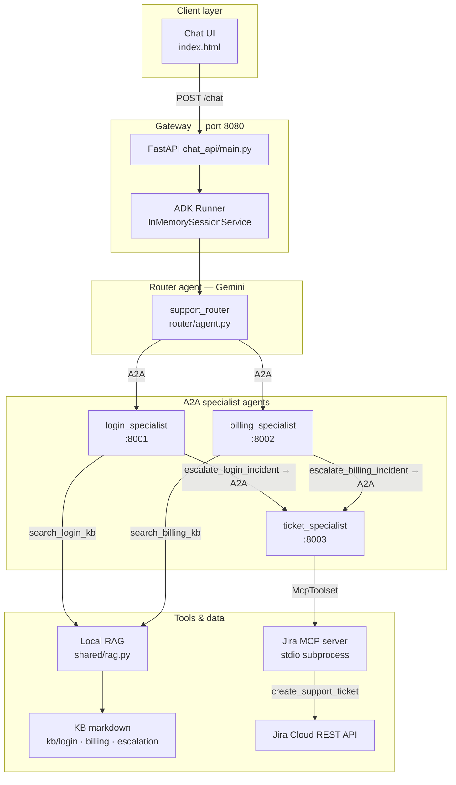
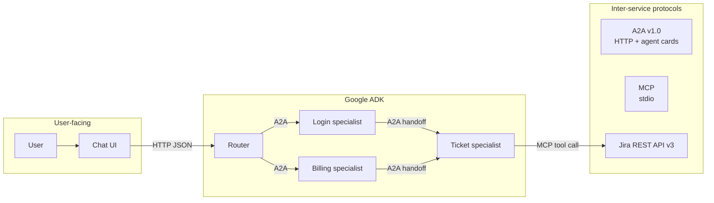
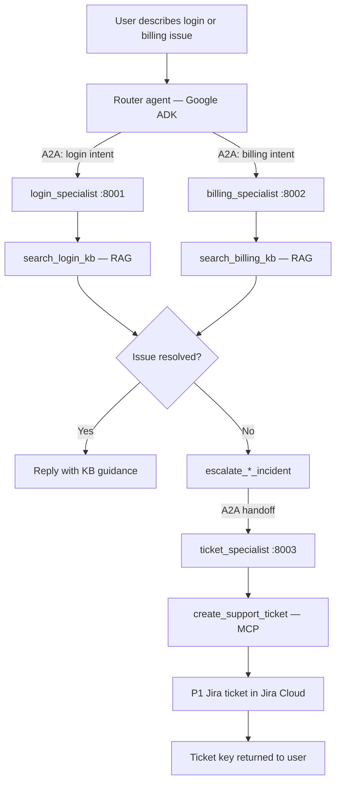
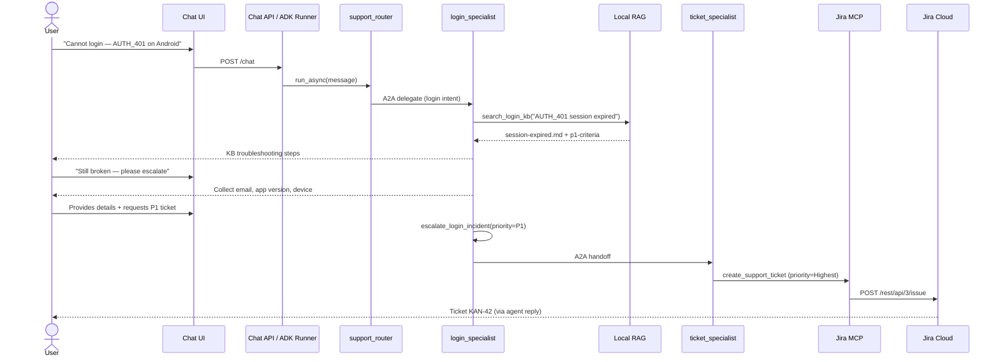
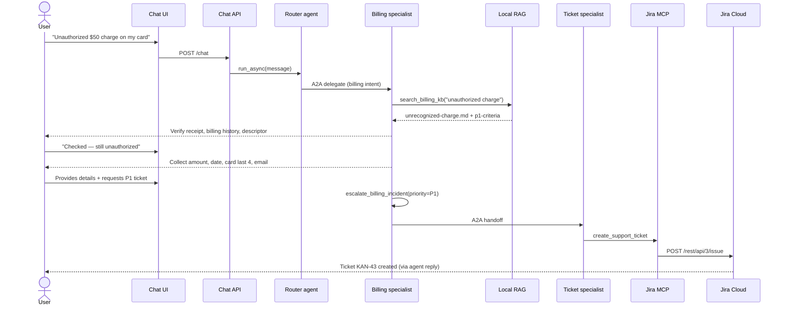
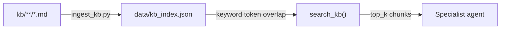
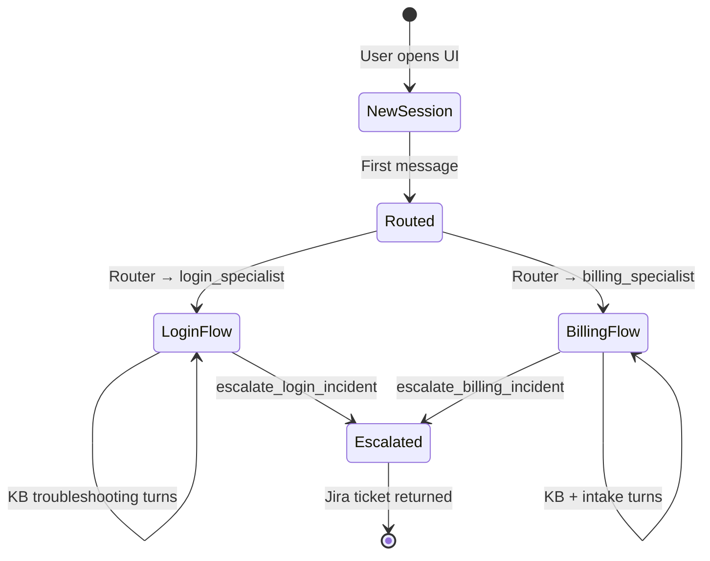

# A2A Support Pilot — Design

This document describes how the pilot satisfies the core requirement:

> A user chats about a billing or login issue. A router agent reaches the appropriate specialist using **A2A**. The specialist uses **RAG** to share troubleshooting guidance. If unresolved, the specialist calls **ticket_specialist** (via **A2A**) to raise a **P1 Jira ticket** using **MCP**. All agents are built with **Google ADK**.

For setup, see [README.md](README.md). **Demo video:** [docs/demo.webm](docs/demo.webm)

---

## Pilot objective → implementation

| Requirement | Implementation |
|-------------|----------------|
| User chats about login/billing | Chat UI → `POST /chat` → ADK Runner runs `support_router` |
| Router reaches correct specialist | `router/agent.py` — `RemoteA2aAgent` delegates to `:8001` or `:8002` |
| Specialist uses RAG | `search_login_kb` / `search_billing_kb` → `shared/rag.py` → `kb/` markdown |
| Specialist shares KB feedback | LLM synthesizes RAG results into user-facing troubleshooting steps |
| Unresolved → ticket_specialist | `escalate_*_incident` sets `transfer_to_agent = "ticket_specialist"` (A2A) |
| P1 Jira ticket via MCP | `ticket_specialist` → `McpToolset` → `create_support_ticket` → Jira REST API |
| Google ADK throughout | `Agent`, `Runner`, `to_a2a`, `RemoteA2aAgent`, `McpToolset` |

### Technology roles

| Technology | Role |
|------------|------|
| **Google ADK** | Agent definitions, tool execution, session management, A2A server/client |
| **A2A protocol** | Router ↔ specialists and specialists ↔ ticket_specialist (HTTP + agent cards) |
| **RAG** | Keyword search over indexed KB; specialists call RAG before escalating |
| **MCP** | Jira tool exposure; only `ticket_specialist` talks to Jira (separation of concerns) |

---

## System architecture



### Component map

| Component | Port / transport | Technology | Responsibility |
|-----------|------------------|------------|----------------|
| Chat UI | 8080 (HTTP) | HTML + fetch | User-facing chat; maintains `session_id` |
| Chat API | 8080 (HTTP) | FastAPI + ADK Runner | Runs router agent per message; session state |
| Router agent | In-process | Google ADK + Gemini | Classify intent; delegate to login or billing specialist via A2A |
| Login specialist | 8001 (A2A) | Google ADK + Gemini | Login troubleshooting via RAG; escalate to ticket agent |
| Billing specialist | 8002 (A2A) | Google ADK + Gemini | Billing disputes via RAG; escalate to ticket agent |
| Ticket specialist | 8003 (A2A) | Google ADK + Gemini | Parse handoff; create Jira ticket via MCP |
| Jira MCP server | stdio | FastMCP + httpx | `create_support_ticket` → Jira REST API v3 |
| Knowledge base | Local files | Markdown | 7 articles across login, billing, escalation |
| RAG index | `data/kb_index.json` | Keyword search | Built by `scripts/ingest_kb.py` |

### Agent registry

Agent metadata is published at:

- A2A agent cards: `http://127.0.0.1:{8001,8002,8003}/.well-known/agent-card.json`
- Static registry: `router/registry.json` (also exposed at `GET /registry`)

---

## Protocol boundaries



| Boundary | Protocol | What crosses it |
|----------|----------|-----------------|
| UI → Chat API | HTTP POST `/chat` | `{ message, session_id }` → `{ reply, session_id }` |
| Router → Specialists | A2A | User message + conversation context |
| Specialists → Ticket agent | A2A + structured handoff string | Incident type, user details, priority, chat summary |
| Ticket agent → Jira | MCP (stdio) | `create_support_ticket(summary, description, priority, labels)` |

---

## End-to-end pilot flow



---

## User flow — login issue

Typical path when a user reports `AUTH_401 session expired`:



### Login specialist behavior

1. **Search KB first** — `search_login_kb` on every new issue
2. **Share RAG guidance** — troubleshooting steps from KB before collecting PII
3. **Collect details** — email, app version, device, steps tried (when escalation is likely)
4. **Escalate via A2A** — `escalate_login_incident` → `ticket_specialist` (not direct Jira)
5. **P1 criteria** — lockout, persistent AUTH_401 after KB steps (per `kb/escalation/p1-criteria.md`)

---

## User flow — billing dispute

Typical path for an unauthorized charge:



### Billing specialist behavior

1. **Search KB first** — `search_billing_kb` on charge/dispute reports
2. **Self-service steps** — payment history, email receipt, statement descriptor
3. **Collect details** — amount, date, card last 4, account email (never full card or CVV)
4. **Escalate via A2A** — `escalate_billing_incident` → `ticket_specialist` (not direct Jira)
5. **P1 criteria** — fraud, unauthorized charge > $50, or duplicate charges in 24h

---

## Escalation handoff format

Specialists do not call Jira directly. The `escalate_*_incident` tools set `transfer_to_agent = "ticket_specialist"` and return a structured handoff string:

```
LOGIN INCIDENT HANDOFF — create Jira ticket
type: login_incident
priority: P1
user_email: user@example.com
error_message: AUTH_401 session expired
app_version: 5.6
device: Android 14
steps_tried: cleared cache, reinstalled app
kb_article_used: session-expired
chat_summary: User still blocked after KB steps
```

The ticket specialist parses this, formats a Jira description, and calls `create_support_ticket` with:

- **P1** → Jira priority `Highest`
- **P2** → Jira priority `High`

---

## RAG design



| Aspect | Choice | Rationale |
|--------|--------|-----------|
| Storage | JSON index of text chunks | No Chroma/torch — runs on Windows ARM and low-resource machines |
| Chunking | 500 chars, 80 char overlap | Fits article sections; simple and predictable |
| Retrieval | Token overlap scoring | Good enough for small KB (7 articles, ~16 chunks) |
| Scope | Specialists search own domain + escalation KB | Escalation criteria available during P1/P2 decisions |

KB articles:

| Domain | Articles |
|--------|----------|
| Login | `session-expired`, `invalid-credentials`, `account-locked-2fa` |
| Billing | `unrecognized-charge`, `duplicate-subscription`, `refund-policy` |
| Escalation | `p1-criteria` |

---

## Session and state



- **Chat API** stores conversation history in ADK `InMemorySessionService` keyed by `session_id`
- **UI** sends the same `session_id` on each turn so agents retain context
- **Refresh the page** to start a new session (new UUID)

---

## Key design decisions

| Decision | Why |
|----------|-----|
| Router does not solve issues itself | Demonstrates clean A2A delegation; specialists own domain expertise |
| Specialists escalate via A2A, not direct Jira tools | Separates support logic from ticketing; ticket agent is reusable |
| Jira via MCP stdio subprocess | Standard tool protocol; ticket agent spawns MCP on demand |
| Lightweight keyword RAG | Pilot runs without GPU; KB is small and curated |
| Four separate processes | Each agent is independently deployable with its own A2A agent card |
| Gemini on every agent | Full LLM reasoning at each layer; ~2–3 API calls per user message |

---

## File map (design-relevant)

```
chat_api/main.py          # FastAPI gateway, ADK Runner, /chat endpoint
chat_api/static/index.html
router/agent.py           # Router agent + RemoteA2aAgent peers
router/registry.json      # Agent skill registry
agents/login_specialist/  # Login agent + RAG + escalation tool
agents/billing_specialist/
agents/ticket_specialist/ # Ticket agent + Jira McpToolset
mcp_servers/jira_server/  # create_support_ticket MCP tool
shared/rag.py             # KB ingest + keyword search
shared/tools.py           # search_*_kb, escalate_*_incident
shared/config.py          # Env config (Gemini, Jira, agent URLs)
kb/                       # Source knowledge articles
scripts/ingest_kb.py      # Build RAG index
scripts/start_all.ps1     # Launch all services
docs/demo.webm            # Demo recording
```
